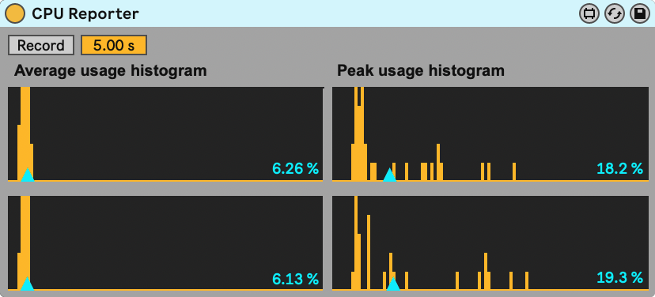

# Measuring CPU Load #

When refactoring or adding features to a Max for Live device, it can be important to know how this affects the device's CPU usage. Live's CPU Load Meter gives you a rough impression but since it fluctuates, it can be hard to draw conclusions. 

The CPU Reporter is a small device that gives you more insight into a Live Set's average and peak audio CPU usage over time.

After recording the CPU usage for a chosen amount of time, this device shows the reported average and peak values during the recording time. It also shows the total average of the average values and the maximum of the peak values within that time frame.

## Using the CPU Reporter ##

* Create a Live Set with the device to test. Create a typical usage scenario, or an extreme scenario if that is what you want to test.
* Duplicate the device or the track with the device multiple times until Live's CPU Load Meter is around 50%.
* Add the CPU Reporter device to any track of your Set.
* Play the Set. When the CPU Load Meter stays at a relatively steady value, press Record.
* Without changing the Set, compare the reported values before and after changing the device you want to test.
* For some extra insight, repeat this with different Buffer Size settings (to be found in Live in Preferences / Audio, under Latency).

## Monitoring other CPU usage ## 

The CPU Recorder device only reports Live's CPU usage for audio signal processing calculations, which can make your audio click or stutter when it goes over 100%. The device does not give you insight in how many of your CPU Live uses for other tasks, such as redrawing the interface.

Measuring the overall CPU usage of Live can be done with the Activity Monitor (macOS) or Task Manager (Windows).
