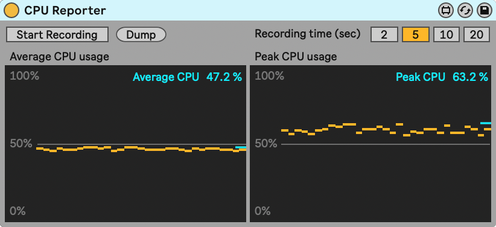

# Measuring CPU #

When refactoring or adding features to a device, it can be important to know how this affects its CPU usage. The CPU Reporter device gives you insight in the average and peak CPU usage of a Live Set.

After recording the CPU usage for a set amount of time, this device shows a histogram of the reported average and peak values during the recording time, as well as the averages of these values within that time frame.

## Using the CPU Reporter ##

* Create a Live Set with the device to test. Create a typical usage scenario, or an extreme scneario if that is what you want to test.
* Duplicate the device or the track with the device multiple times until Live's CPU meter is around 50%.
* Add the CPU Reporter device to the Set.
* Play the set. When the CPU meter stays at a relatively steady value, press Record.
* For some extra insight, repeat this with different Buffer Size settings (to be found in Live in Preferences / Audio, under Latency).
