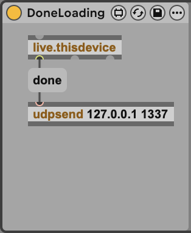
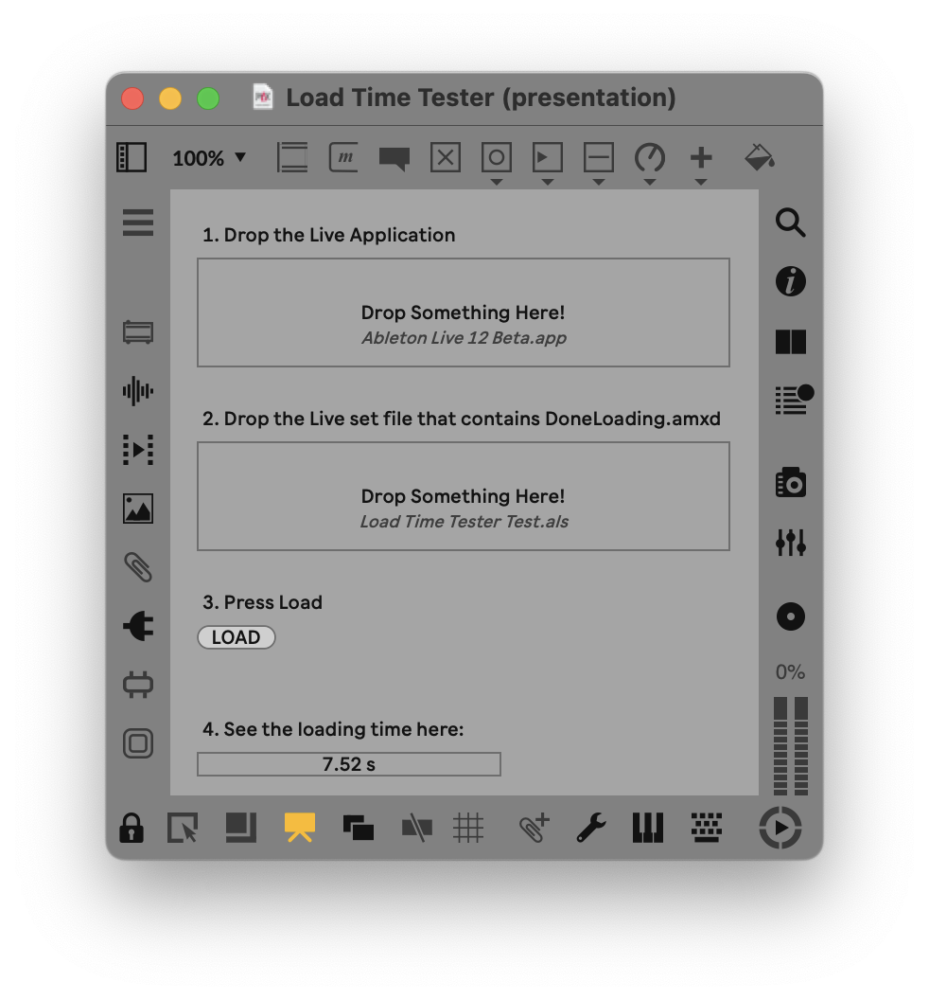

# Measuring loading time #

When refactoring or adding features to a Max for Live device, it can be important to know how this affects the device's loading time. Manually timing this can be sufficient but sometimes you'd like to get a more precise and consistent measurement.

The Load Time Tester is the combination of a Max device and a small patch that give you insight into a Live Set's loading time.

To measure the loading time of a device, you can include the device in a Live Set and use the patch to launch a specific version of Live with the Set to measure how long it takes for this Live Set to be loaded.

## Using the Load Time Tester ##

* Create a Live Set you want to test for loading. 
	* If you want to test the loading time of a single device, you can add mutliple copies of the device to the Set, depending on its typical use.
	* Make sure to include one copy of the `Done Loading.amxd` device in the Set.
* Load the `Load Time Tester.maxpat` patch in standalone Max and set its paths:
	* Find the Live application you want to use for testing on your computer and drag the application to the first drop panel in the Load Time Tester.
	* Find the Live Set and drag it to the second drop panel in the Load Time Tester.
* Get the system to consume little resources
	* Launch the selected Live application manually and close it once, to allow the operating system to cache as many of the application launching as possible.
	* Close any instance of Live
	* Make sure no heavy processes are running on your computer.
* Press LOAD in the Load Time Tester.
* Wait for the Live application to launch and for the application to load the Live Set.
* Find the loading time in the number box in the Load Time Tester.
