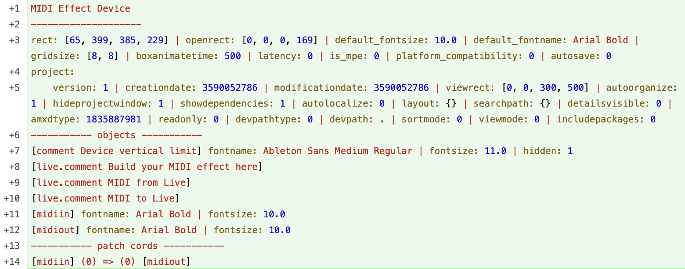
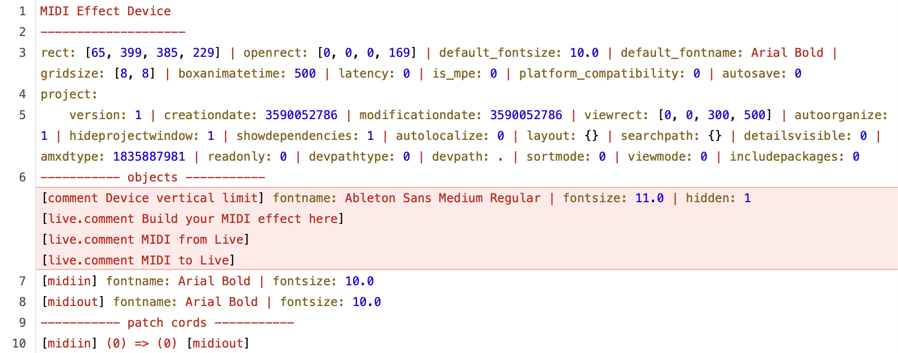

# Diffing patches

A way to diff condensed representations of Max patches and Max for Live devices, so the diff is more readable. Also shows the XML content of `.als` files, regardless of whether they are gzipped.

In a git client like Tower, this is how it looks.

Adding a new Max MIDI Effect without changes:



Removing the comments from the new MIDI Effect:



> :pushpin: the condensed summary shows all the patch information and connections between objects. Any objects or data that cannot be parsed will be included as raw json. The summary only shows object properties that don't have a default value.

For `.amxd` files:
* The scripts will also tell you what device type it is. 
* If a device is frozen, you will only see a notice saying that the device is frozen, the content will not be shown. We aim never to commit frozen devices to a git repo, instead we include the dependencies as separate files.

## Why?

Readable diffs are very useful for patch code review, or for a sanity check before committing (did I really change nothing else expect removing all my debug messages and prints?).

## Prerequisites

Requires Python 3.10 or higher to be installed, and assumes it is aliased as `python3`. For example on Mac, [Homebrew](https://brew.sh/) should automatically set this up when installing with:

```bash
brew install python
```

## Setup

1. In a `.gitattributes` file in the root of your repo, apply diff attributes for `.maxpat`, `.amxd` and `.als` files:
```text
*.maxpat              text diff=maxpat
*.amxd                binary diff=amxd
*.als                 binary diff=als
```

2. To make the repository use the custom text converter scripts, add them to your local git configuration: in your `.git` folder, you'll find the `config` file. Assuming this repo is checked out in your home folder, you can add these lines:

   ```text
   [diff "maxpat"]
     textconv = python3 ~/maxdevtools/maxdiff/maxpat_textconv.py
   [diff "amxd"]
     textconv = python3 ~/maxdevtools/maxdiff/amxd_textconv.py
     binary = true
   [diff "als"]
    textconv = python3 ~/maxdevtools/maxdiff/als_textconv.py
    binary = true
   ```

3. Now `git diff` will show you changes in max patch and device files in a condensed format.

## What does not work

Typical things you can do with text-based code that will not work with Max patches or devices:
* Resolving merge conflicts
* Staging or discarding lines or chunks

Note that `git-format-patch` (see [man](https://git-scm.com/docs/git-format-patch)) does still work, since by default it ignores the `textconv` setting.

# Please get in touch when the script doesn't work with your patch

This tool is an on-going work in progress. If you have a Max patch or device that results in an error or is not represented as you would expect, please [create an issue on github](https://github.com/Ableton/maxdevtools/issues) and include the patch that doesn't work plus a description of the problem you're seeing.

# Contributing

Contributions are welcome. Feel free to fork this repo and submit a Pull Request.

Code is formatted using black:
* Install [black](https://pypi.org/project/black/)
* Run `black .` in the repo root

## Typing and using mypy in development

This codebase uses the optional [typing](https://docs.python.org/3/library/typing.html) available in Python. This makes it so other tooling such as [mypy](https://mypy-lang.org/) can statically analyse your code for errors before you've even run a test. This synergy of types and tooling is useful in an automated context and for doing holistic evaluation, but also the types themselves can provide useful information to people reading and extending the codebase.

[mypy](https://mypy-lang.org/) is relatively easy to setup with its [getting started](https://mypy.readthedocs.io/en/stable/getting_started.html) instructions. Once setup, you can check `maxdiff` as a whole project for type issues by running `mypy maxdiff` from the root of this monorepo, or `mypy .` if your current working directory is already set to the `maxdiff` project.


## Testing

Whenever making a change, we test that the previous functionality still works as before. For more info, see the [tests](tests/) folder.
