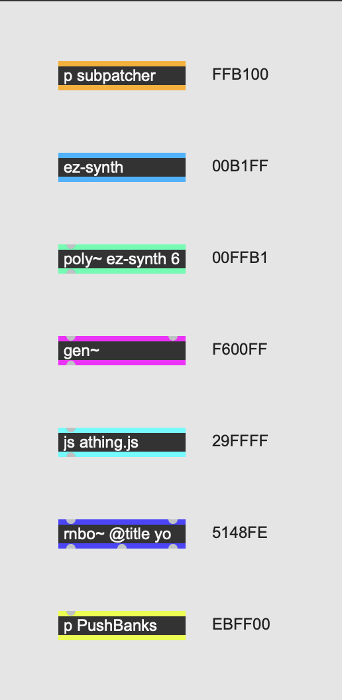

# Object border colors

To make it easy to scan a patch for deeper levels of code, we add colors to borders of objects that contain more patching or code:

| Type          | Color   |
| --------      | ------- |
| Subpatcher    | #FFB100 |
| Abstraction   | #00B1FF |
| poly~         | #00FFB1 |
| gen~          | #F600FF |
| js            | #29FFFF |
| rnbo~         | #5148FE |
| Push banks    | #EBFF00 |

We deviate from the Max defaults for this because it significantly enhances readability.

