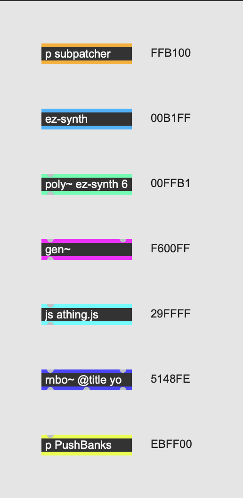

# Object border colors

To make it easy to scan a patch for deeper levels of code, we add colors to borders of objects that contain more patching or code.

We deviate from the Max defaults for this because it significantly enhances readability.

