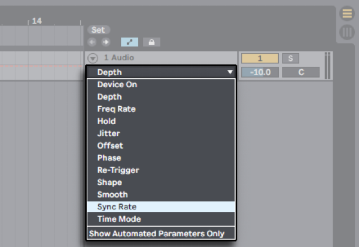
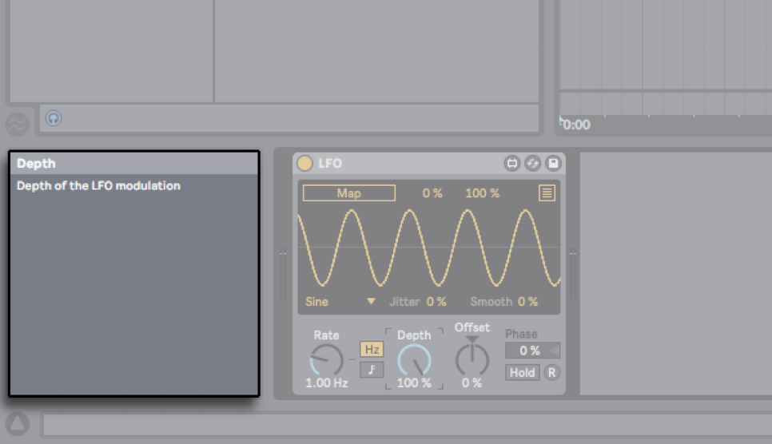
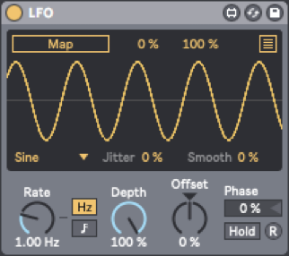

# Max for Live Production Guidelines

Considerations for sharing your Max for Live device.

## Introduction

*Welcome to the Max for Live Production Guidelines! If you make your own Max for Live devices, and are interested in sharing your work with others, then this guide is for you. It is a collection of suggestions that we recommend keeping in mind in order to be considerate to anyone who will be using your device. In the case that you do not necessarily want to share your device, but will still be using your own device, these recommendations are also applicable!*

Besides the technical knowledge that one must have in order to make a functioning Max for Live patch, there are a few other aspects for developers to consider that can make or break the experience of using a Max for Live device. This guide will provide you with suggestions to effectively avoid common pain points for Max for Live device users, so that your Max for Live instrument or effect may be enjoyed to the fullest extent.

That being said, the recommendations are merely considerations to be made, and you can of course ultimately patch however you see fit! These suggestions are not always applicable, so use your own judgement on whether or not it feels right to you as the device developer to implement the advice. Keep in mind, for example, that dismissing some of the recommendations could break device functionality, while others only refer to aesthetic preferences.

Please note that this document does not aim to explain what Max for Live is, nor is it a beginner’s guide on how to patch in Max. Anyone reading this guide should already have a solid understanding of how Max works. If you don’t know much about Max for Live, and are curious to know more, please check [Appendix B - Learning](#appendix-b---learning) for a list of resources.

This document assumes you are using the latest vesions of Max and Live.

### Notations

Max objects will be denoted with brackets, i.e `[live.path]`.

### Chapter Overview

[Concepts](#concepts): A spotlight on some Max concepts that are specific to Max for Live. It is good to be aware of these concepts when intending to share or distribute a device.

[Parameters](#parameters): Recommendations for the effective use of device parameters. By providing consistency with the way that Live parameters work natively, the Max for Live device will feel familiar and easy to use.

[Design](#design): Suggestions for a consistent and flexible device UI. This is also about how the device communicates itself, in order for it to appear professional.

[Performance](#performance): How to avoid common device performance pitfalls and bugs, for a device that is reliable in its performance.

[Patch Formatting](#patch-formatting): Note about the organization of patches. If someone were to press the Edit button on your Max for Live device in Live, they should ideally be presented with a clean, legible patch, that can be clearly understood, learned from, and even re-used.

[Final Checklist](#final-checklist): Final words, and checklist for QA testing.

[Appendix A - Help and Support](#appendix-a---help-and-support): Finding help with usability topics, and technical support.

[Appendix B - Learning](#appendix-b---learning): Helpful resources for beginners.

## Concepts

A spotlight on some Max concepts that are specific to Max for Live. It is good to be aware of these concepts when intending to share or distribute a device.

### Freezing

Once you have finished patching your Max for Live device and are ready to distribute it, remember to **freeze** it.

Freezing a Max device is similar to Live’s **Collect All and Save** function. It prepares the device for distribution, by making sure that it contains all the files it needs to operate.

Max analyzes your device to find any files it uses, and consolidates these files within your device. When a frozen device is then opened on another user’s computer, the files used by the device are referenced correctly. These files, referred to as **dependencies**, are most commonly abstractions, audio files, and image files, but can also include Javascript code or third-party Max externals.

Failing to freeze a device before sharing or distributing it can often result in a device malfunctioning due to broken file references.

To freeze your device, click the snowflake icon in the device toolbar, then save the device, ideally under a different name. Preferably continue developing from the unfrozen version instead of unfreezing the frozen device, see [Version Management](#version-management).

### Inspector

You can set your device to always **Open in Presentation mode** in the following way:

In an unlocked patcher with no objects selected, right-click the patcher background and select **Inspector Window**. This will open the Inspector window for the patch. Then, go to **View > Open in Presentation**.

Note that this option is only available in the Inspector window that pertains to the whole patch. You can toggle the Inspector window for **individual objects** by selecting the object first, then using the key command **Cmd+I / Ctrl+I**.

### Project Window

You can view your device’s dependencies in a dedicated file manager window by clicking **Show Containing Project** in the toolbar.

### Local and Global Naming

The **‘name space’** in Max is global - when you have objects that have names associated with them such as `[send]`, `[receive]`, `[coll]`, or `[buffer~]`, you can share data between Max for Live devices. In these cases, the Max name space is shared, but the ‘signal processing space’ is independent - each Max for Live device processes its audio data separately.

If you want a named object to be local to a device, use three dashes (`---`) to start the name of your `[buffer~]`, `[coll]`, or `[send]`/`[receive]` pair (e.g. `[s ---filtercutoff]`). When your patch is initialised, it will replace the three dashes with a number that is unique to your device, for example `[s 024filtercutoff]`.

## Parameters

Recommendations for the effective use of device parameters. By providing consistency with the way that Live parameters work natively, the Max for Live device will feel familiar and easy to use.

### Parameter Names

There are several ways to name a parameter in a device, which can be set using an object’s Inspector:

* **Short Name**: for the UI object label.
* **Long Name**: for automation and MIDI mapping.
* **Scripting Name**: for use with the [pattr] preset objects or scripting.

Keep the **Short Name** short enough to avoid the label being truncated, whereas the **Long Name** can be more descriptive and use full words. An example of this distinction would be ‘Env’ and ‘Envelope’, or ‘Freq’ and ‘Frequency’.

Both the **Long Name** and the **Scripting Name** have to be unique within your device. 

If your device loads multiple copies of an abstraction that contains parameter objects, note that Max wil automatically duplicate names by appending an integer like `[1]`. 

### Parameters Window

In Max, go to **View > Parameters** to open a window in which you can edit attributes for all parameters at once.

### Parameter Type and Unit Style

`[live.*]` UI parameters can be set to one of three main Types in the object Inspector:

* **Int**: Integer values in the range of 0 - 255
* **Float**: Floating point values (no range restriction)
* **Enum**: An enumerated list of items

Keep in mind that Enum-type values will display a stepped automation lane in Live’s automation view. Int-type parameters display a grid with a continuous automation line, but the resulting value will be rounded.

Furthermore, parameters have a **Unit Style** setting, which determines how the parameter value is displayed. 

It is possible to set a parameter’s **Type** to **Float** while setting its **Unit Style** to **Int**. In doing so, the parameter value will be stored as a floating-point number, but displayed as an integer.

The **Custom** Unit Style allows adding a custom unit in the **Custom Units** field. Additionally, it supports [printf](https://cplusplus.com/reference/cstdio/printf/)-style strings. For more information, see the [Setting a custom unit style](https://docs.cycling74.com/max8/vignettes/live_parameters#Setting_a_custom_unit_style) section in the Max reference.

If you don't want a parameter's automation lane to show as a grid, but you do want its value to display as an integer percentage without decimals, it is possible to set a parameter's **Type** to **Float** while setting its **Unit Style** to **Custom** and its **Custom Units** to `"%.0f %"`.

### Automation

Parameters can be made available for automation in Live, by setting the Parameter Visibility to Automated and Stored in the Parameter section of the object Inspector.

By default, automation parameters in new Max for Live devices are called live.numbox[1] or live.dial[3]. These default parameter names should be changed to meaningful names (ideally the parameter name as displayed within the UI itself), so that a user can identify them easily in the list of automation parameters in Live.

You can check the automation parameters by loading the Max for Live device in Live. Switch to **Arrangement View**, toggle **Automation mode** (key command A), and open the list of automation parameters for the track that contains the device.

### Saving Parameters

Usually, users of Max for Live devices expect all devices parameters to be **stored and recalled correctly** with the Live Set or Live preset, otherwise the device is of limited use when customized.

To check this, open the AMXD file in Live, change some parameter values, then save and close the Live Set. Re-open the saved Live Set to verify that parameter settings are recalled correctly.

If a parameter is not being saved with the Live Set, it could be one of two issues:

1. The UI object is not a **`[live.*]` UI object** — Try using the designated Live UI objects instead, since they have been designed to work seamlessly with Live’s mapping capabilities, can be automated in Live, and allow for an initial value to be saved when a device is instantiated (**Initial Enable/Initial Value** in the object Inspector).
2. **Parameter Visibility** is set to Hidden — Check that it is set to either **Automated and Stored** or **Stored Only**. This attribute can be found in the UI object’s Inspector window in the Parameter section.

Note that there are some cases in which you may want to have a parameter set to Hidden, usually when it affects other Max for Live parameters. This will prevent problems with overloading Live’s undo buffer, and will also limit issues with preset storage. 

Tip: In Max, go to **View > Parameters** to open a window in which you can edit attributes for all parameters at once.

### Presets

What your device is and what it does may seem obvious to you as the device developer, but it is helpful for everyone else to be shown more explicitly in case they don’t fully understand its capabilities right away.

Try providing some versatile **presets**, or even a **demo Live Set** that showcases your device. This will help other users to understand the purpose and characteristics of your device.

Consider what the default sound of the device should be when first loaded, in order to best showcase the capabilities or personality of the instrument.

Default parameter values can be set in the object Inspector in the **Parameter** section, by using the **Initial Enable** option and setting an **Initial Value**.

### Info text

**Info text** is displayed in the Live **Info View** when hovering the mouse over a parameter. This helps users understand the meaning of individual functions of the device.

Info Text can be added for UI objects in the object Inspector in the **Description** section. **Annotation Name** refers to the header of the Info Text, and **Annotation** refers to the contents of the Info Text.

Check that it works by loading the device, then hover the mouse over parameters to check that the Info Text shows up correctly in Live’s Info View.

### MIDI Mapping

Making parameters **MIDI-mappable** will allow users to control parameters with any MIDI controller. 

This is most important for all parameters seen in the UI when the AMXD file is first opened in Live. The secondary parameters that are not immediately visible on instantiation (because they appear in a pop-up window or a fold-out view or a tab) could also be considered for MIDI Mapping.

To check this, load the device, enable **MIDI Map mode** in Live with the key command **Cmd+M / Ctrl+M**, and check that all device parameters have a blue overlay.

If the parameters are not mappable, it may be that you are not using `[live.*]` objects, or that the UI object Parameter Visibility has not been set to Automated and Stored in the Inspector.

### Push support 

Device parametes can be mapped to Push by using the `[live.banks]` system. See the `[live.banks]` help patcher or [reference](https://docs.cycling74.com/max8/refpages/live.banks) for more information.

## Design

Suggestions for a consistent and flexible device UI. This is also about how the device communicates itself.

### Live Color Themes

We recommend making sure that your device works with all Live color themes. This feature was introduced in Live 10.

One benefit of supporting the Live themes is that it can also save time in development, because `[live.*]` objects and their various states link to them by default. Consider that making your device look like native Live devices also helps provide users with a consistent experience in Live.

For an object color to automatically follow Live themes, it needs to be set to its default value with the Set to Default Value option in the Max inspector.

Notice that many `[live.*]` objects have separate colors for when the device is active and for when the device is inactive. When using the dynamic inactive colors, these too will follow themes.

Note that for a `[live.*]` object that is not a parameter object, like `[live.scope~]` and `[live.meter~]`, currently its inactive colors are shown only when the active attribute of the object itself is set to **0**. To make an object like this follow the device enabled state, you can control its active attribute with the second outlet of `[live.thisdevice]`.

If you choose to not follow Live themes, be mindful of the fact that there are some cases in which it may impair legibility, i.e certain UI elements being visible in some themes but not others. 

Notice, for example, that in the screenshots below the black text changes to white text when darker themes are used.

Device colors can be adjusted to the current Live themes with the `[live.colors]` object. See the `[live.colors]` Help patcher or [reference](https://docs.cycling74.com/max8/refpages/live.colors) for more information.

You can check that this has been correctly implemented by loading your device, opening the **Look/Feel** tab in Live’s Preferences, and cycling through the selection of color themes.

### Fonts

**Ableton Sans** is included as a standard font in Max. It can be selected from the Inspector, for any text-based object parameter, i.e a [comment] or [live.dial] label. Use this type face for a look that is consistent with Live’s devices.  

For non-UI objects, notice that when objects are encapsulated instead of kept in the top level patch, by default they change their fonts to the standard Max font. 

### Device Width

Live’s **Device View** has a fixed height, which can increase the inconvenience of horizontal scrolling. You can accommodate for this by reducing the width of each device as much as possible.

One way to judge whether the width of your device is potentially problematic or not, is to compare it to functionally-similar existing devices.

For example, is your Max for Live device a synth with a lot of included features and parameters? If so, it can have a large device width like Poli from the Creative Extensions Pack. Is your device more of a utility? Then it might make more sense for it to be as narrow as Live's built-in LFO. If you have a complex audio effect, you could use the width of Convolution Reverb Pro from the Convolution Reverb Pack as a reference.

If you find that your device takes up too much horizontal space to your liking, there are several ways to reduce its width:
* **Fold-out view**: Set the device width dynamically by clicking an arrow button. This works particularly well for separating the main device parameters from device configurations. For example, Surround Panner from the Surround Panner Pack provides the option to fold or unfold the I/O configuration section.
* **Tabbed view**: Create several tabs in order to re-use the same area in the device multiple times. This can be useful when your device has a large number of parameters that can be grouped into individual categories that don’t need to be visually present all at once. For example, Convolution Reverb Pro from the Convolution Reverb Pack integrates tabs into its design, to control different aspects of the sound design such as EQ, Panning, and Modulation.
* **Overlay view**: This refers to a button that toggles an overlay view over the entire device, which can be a useful way to introduce an advanced parameters section. For example, Live's built-in LFO has a button in the top-right corner of the device that toggles its Multi-map options as an overlay.

For each of these cited example devices, you can open the Max for Live Editor to see how this has been implemented.

### `[live.*]` Objects

There are several settings in the Object Inspector that we recommend for best use of the **`[live.*]` UI objects**.

For the **Presentation Rectangle** setting, make sure that widgets are sized in **whole pixels** to avoid blurry shapes on non-retina screens, by using numbers like ‘4’ instead of ‘4.3562635’. Re-positioning objects with click-drag often results in these decimal point numbers, so be sure to check the Inspector for object dimensions and positions in Presentation Mode when fine-tuning the device UI.

Use the **LCD** mode for the **Display Style** in `[live.tab]`, `[live.numbox]`, and `[live.text]`, which was designed to mirror Live’s UI parameters. This ensures that pixels snap to the pixel grid on non-retina screens. Note that this Display Style is not selected by default.

Make sure that **Mouse Up** (in the **Behavior** section) is selected as the **Output Mode** for `[live.text]`, since it will match Live’s native button behavior. Note that this Output Mode is not selected by default.

### Pop-out windows

Although this is ideally avoided, if you need more interface real estate than the device view offers, you may want to add a pop-out window to your device by means of a sub patcher that is opened with a `[pcontrol]` object.

However, it is important to consider what happens when Live is in full-screen mode when this window is opened.

If the subpatcher window is not a floating window, opening it will take Live out of full-screen mode, which is undesirable in most cases. 

Therefore it is recommended to always set pop-out windows like these to floating mode:

## Performance

How to avoid common device performance pitfalls and bugs, for a device that is reliable in its performance.

### OS Compatibility

For everyone to be able to use your device, it should work on both **Mac and PC** so that a Live Set using the Max for Live device is cross-compatible. 

Note: Max external objects that are not included in the standard Max distribution need to be compiled separately for Mac and PC platforms by their developers.

### Max Console

It is recommended to try minimizing the output to the **Max Console window** as much as possible.

Although verbose output during development can be useful for debugging, seeing errors and other messages in the console could make the device appear untrustworthy to the user.

Open the AMXD file in Live, right-click on the device’s title bar and choose **Open Max Window** to check for any error messages being printed to the Console. To be safe, you can also double-check on a different computer.

### Undo History

Some Max for Live devices that use internal modulations may create a very large number of Undo events, rendering Live’s Undo function useless as a result. This can of course be frustrating for any Live user.

This happens when a live parameter object like `[live.dial]` has its **Parameter Visibility** attribute set to **Automated and Stored** (default) or **Stored Only**, and is then controlled internally by the patch, like this:

Your device will now be sending a constant stream of the same Undo action to Live, so any other action you perform in the program can’t be undone because it is instantly ‘buried’ by this constant stream of Undo actions.

To check this, load the device, enable any modulations, and start Live’s playback. Perform an action in Live to create an undo event (e.g. create a new MIDI track). While Live is running, check that the **Edit** menu shows **Undo Insert MIDI Track** as the last Undo entry. 

If you need to control a native-looking interface element from within your patch, you will likely need to change its **Parameter Visibility** setting to **Hidden**.

Another scenario where **Hidden** is the correct choice, is when using a `[live.text]` object in **Button** mode.

### Playback

Frozen tracks with a Max for Live device should preferably sound the same as unfrozen playback. If this isn’t the case, then you may experience an issue in which the Live Set sounds different on **playback** than when you render the track as an audio file. 

To check this, load your Max for Live device into Track 1 and create a simple clip. Create an audio Track 2 and route the audio from Track 1 into Track 2. Play clips in Track 1 and record the audio into Track 2. Finally, Freeze Track 1, play both Track 1 and 2 and compare output on both tracks.

### Latency

Max for Live allows setting **Defined Latency** in the patch Inspector, Live compensates for this latency on playback. To make sure that your device plays in sync with the rest of the Live Set, it may be required to set the correct device latency. 

To check device latency in Live, load your Max for Live device, then hover your mouse over the **device title bar**. The device latency amount will be displayed in the **Live status bar**.

### CPU Load

Max for Live device performance should be measured in a Live Set within a musical context if possible, to avoid unwanted **CPU usage** spikes.

Check this by loading several instances of your device in a Live Set. Add some other Max for Live devices or Live instruments, and automate some parameters in your Max for Live device.

If parameter automation causes high CPU load, try enabling **Defer Automation Output** in the object Inspector if the automation values are not time-sensitive, or try higher values for the **Update Limit**.

### Updates

Live treats Max for Live devices in a similar way as sample files. Live Sets reference a Max for Live device (the AMXD file), meaning the device is not contained within the Live Set.

If you create a Live Set with a specific device and later change that device, the Live Set may not play back correctly. To assure that a Live Set always plays back correctly, you can store it with a frozen copy of your Max for Live device.

Live stores parameter values for each `[live.*]` parameter that is set to **Automated and Stored** or **Stored Only**. Live identifies the `[live.*]` parameter in a Max for Live device by its **Long Name**. Therefore, avoid changing the Long Name of any `[live.*]` object when updating the device, since this will break the **parameter value recall**.

If you do make significant changes to the device, we recommend publishing the AMXD file with a different file name, in most cases this is done by appending a version number to the file name. 

### Version management

You may want to distribute new frozen versions of a plugin regularly. When continuing work on a plugin, it is recommended not to continue with the frozen, distributed version of a plugin but with the original unfrozen version.

When you unfreeze a plugin to continue editing it, new copies of the dependencies it contained can be stored in a new folder on disk (**~/Documents/Max/Max for Live Devices**). This can cause confusion about which version of your dependencies you are working on.

A good rule could be to always remove the frozen version of a plugin from your system after distributing it.

When working on multiple plugins and providing regular incremental updates, you may want to consider keeping the original versions (not the frozen copies) of your plugins and their dependencies in a version control system like **git**.

Note though that using git requires careful study, we will not cover that in this document.

## Patch Formatting

If someone were to press the Edit button on your Max for Live device in Live, they should ideally be presented with a clean, legible patch, that can be clearly understood, learned from, and even re-used.

Max offers various tools to make a patch easy to understand, such as encapsulation, object coloring, naming, patching and presentation mode, segmented patch cords, `[send]`/`[receive]` pairs with local naming, inlet/outlet descriptions and comments. For an overview, check out the [Organizing Your Patch](https://docs.cycling74.com/max8/vignettes/organizing_your_patch_topic) chapter from the Max Reference Documentation.

What constitues a legible patch can be highly subjective. Here are [the patch code guidelines that Ableton uses](../patchcodestandard/README.md) for built-in devices.

## Final Checklist

Here is a checklist to quickly recap the topics of this guide that can be tested, which you can use for **Quality Assurance** purposes for your device.

* Freezing: The device is frozen.
* Parameter Names: All parameters have a Short Name and a Long Name.
* Saving Parameters: All parameters are stored and recalled correctly with the Live Set.
* OS Compatibility: The device works on both macOS and Windows. 
* Parameter Type: Parameter Types and Units correspond to the kind of data being represented.
* Automation: The device has automatable parameters.
* Max Console: The device does not display red error messages in the Max Console window.
* Undo History: The device does not ‘flood’ Live’s Undo menu.
* Playback: The device sounds identical on playback, on a frozen track, and on rendering an audio file.
* Latency: The device plays in sync with the rest of the Live Set.
* CPU Load: The device does not cause high CPU load in the context of a Live Set.
* Patch Formatting: The patch is clean and legible when opened in the Max for Live Editor.
* Presets: The device comes with a collection of presets.
* Info Text: The device parameters show Info text in Live’s Info View when hovered over with the mouse.
* MIDI Mapping: The main device parameters can be mapped to a MIDI controller.
* Live Skins: The device is legible in all Live color themes.
* Device Width: The device does not take up much of the horizontal space in the Device view.

## Appendix A - Help and Support

Finding help with usability topics, and technical support.

* [Cycling ’74 Forums](https://cycling74.com/forums/)
* [Facebook User Group - Max/MSP](https://www.facebook.com/groups/maxmspjitter/)
* [Facebook User Group - Max for Live](https://www.facebook.com/groups/maxforliveusers/)

* [Cycling ’74 - Max Reference Documentation](https://docs.cycling74.com/max7/)
* [Ableton Knowledge Base - Max for Live](https://help.ableton.com/hc/en-us/categories/201105669-Max-for-Live)

* [Ableton Support](https://help.ableton.com/hc/en-us/requests/new)
* [Cycling '74 Support](support@cycling74.com)

## Appendix B - Learning

Helpful resources for beginners.

* [Ableton - Building Max Devices Pack and videos](https://www.ableton.com/en/packs/building-max-devices/)
* [Cycling ’74 - Max Reference Documentation](https://docs.cycling74.com/max8)
* [maxforlive.com ](maxforlive.com)

How to access built-in **Max Documentation and Tutorials**:
* In Max, go to **Help > Reference**

How to access an **object’s Help patcher**:
* In an unlocked patch, right-click the object and select **Open Help**. You can also hold down the **Alt/Option** key and click on the object.

